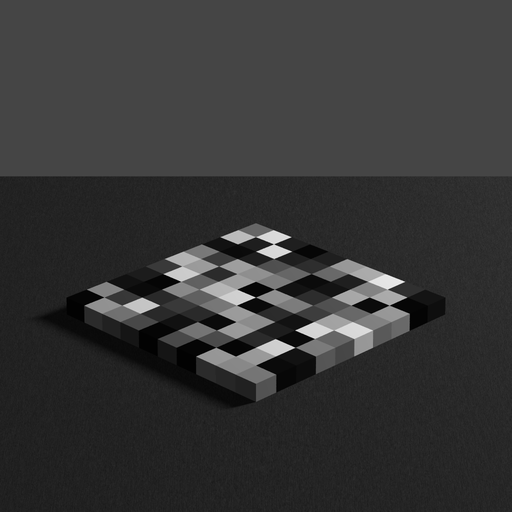

# Asymmetric matching

In an **asymmetric matching** task the participant adjusts a probe until it
looks the same as a target, where probe and target sit in different contexts.
The mismatch is the point: the two are shown in surroundings that differ, so the
setting the participant accepts tells you how much the context changed the
appearance of the target.

In this template the target is a patch in a rendered three-dimensional scene,
and the probe is a small uniform field on a variegated checkerboard, drawn
separately above the scene. The participant changes the intensity of that field
until it matches the target patch, and presses the middle button to accept. One
accepted intensity is one trial result.

The full example is at
[`examples/templates/asymmetric_matching/`](https://github.com/computational-psychology/hrl/tree/master/examples/templates/asymmetric_matching).

What distinguishes it from the other templates is that its stimuli are
**pre-rendered**. They are POV-Ray scenes, rendered offline to `.png` and loaded
from disk at trial time, rather than generated in code. Use this template as a
starting point whenever your stimuli cannot be produced online, whether they are
ray-traced renderings, photographs, or anything else that arrives as an image
file.



Above is one of the demo stimuli, `0_plain_1.67.png`. The number in the filename
is the reflectance `r` of the target patch, and the word is the context in which
it is embedded.


## Overview

```{mermaid}
graph LR;
    setup --> next_block --> run_block
    next_block <--> incomplete_blocks <--> incomplete_trials
    next_block <--> generate_design

    run_block <--> run_trial
    run_trial <--> define
    run_trial <--> field
    run_trial --> display --> capture --> adjust --> run_trial
    run_trial --> save_trial
    run_block --> exit

    generate_design <--> generate_block

    subgraph data_management.py
        incomplete_blocks
        incomplete_trials

        next_block

        save_trial
    end

    subgraph design.py
        generate_design
        generate_block
    end


    subgraph HRL
        display
        capture[capture participant response]
    end

    subgraph stimuli.py
        define[load stimulus]
    end


    subgraph asymmetric_matching.py
        field[matching field]
    end

    subgraph experiment_logic.py
        run_trial
    end

    subgraph adjustment.py
        adjust[adjust matching field value]
    end

    subgraph run_experiment.py
        setup

        run_block

        exit[cleanup & exit]
    end

```

Compare this against the diagram on the
[managing data](../useful-examples/managing-data) page. The outer machinery is
identical. What is new is the inner loop between `run_trial`, `display`,
`capture` and `adjust`, which is the
[method of adjustment](../useful-examples/method-of-adjustment) loop.


## Install requirements

```
pip install pandas Pillow stimupy
```

`Pillow` loads the pre-rendered images and draws text, `stimupy` builds the
checkerboard of the matching field, and `pandas` handles the design and results
tables.


## The design

The design here is unusual in that it is not a factorial combination. The
reflectance and context of each trial are given as two parallel tuples, and
zipped together, because the rendered images that exist on disk determine which
combinations are possible:

```{code-block} python
CONTEXTS = (
    "plain", "light", "light", "dark", "dark",
    "plain", "plain", "light", "plain", "dark",
)
RS = (1.67, 1.29, 0.46, 1.67, 0.82, 0.46, 0.31, 0.63, 0.11, 1.67)


def generate_block():
    # Combine all variables
    trials = [(r, context) for r, context in zip(RS, CONTEXTS)]

    # Convert to dataframe
    block = pd.DataFrame(trials, columns=["r", "context"])

    block.index.name = "trial"

    return block
```

```{important}
Note that trial order is **not** shuffled here (the shuffling lines are
commented out in the source). That is because the filename of each stimulus
image contains the trial index, so trial `n` must load image `n`. If you adapt
this template, either keep the index attached to the design or name your images
by their parameters rather than their position.
```

`design.py` can also be run directly, in which case it asks how many repeats to
generate and writes the design files without starting an experiment:

```
python design.py
```


## Loading a pre-rendered stimulus

`stimuli.py` is short, because generating the stimulus is somebody else's
problem. It reads a `.png`, converts it to greyscale, and scales into the
`[0.0, 1.0]` range that `HRL` expects:

```{code-block} python
def image_to_array(fname, in_format="png"):
    """
    Reads the specified image file (default: png), converts it to grayscale
    and into a numpy array
    """
    im = Image.open(f"{fname}.{in_format}").convert("L")
    temp_matrix = [im.getpixel((y, x)) for x in range(im.size[1]) for y in range(im.size[0])]
    temp_matrix = np.array(temp_matrix).reshape(im.size[1], im.size[0])
    im_matrix = np.array(temp_matrix.shape, dtype=np.float64)
    im_matrix = temp_matrix / 255.0
    return im_matrix
```

The `.convert("L")` is what makes an RGB file usable: `HRL` in greyscale mode
wants a two-dimensional array. The division by 255 maps 8-bit pixel values onto
intensities.

```{note}
Reading pixel by pixel, as this function does, is slow for large images. It is
called once per trial, before anything is timed, so it does not affect the
experiment. If you load images inside a timed sequence, use
`np.asarray(im) / 255.0` instead.
```

The demo stimuli live in `stimuli/DEMO/`, alongside the `.pov` files they were
rendered from. Stimuli for a real participant go in `stimuli/<participant>/`,
which is how `run_trial` finds them:

```{code-block} python
stim_name = f"../stimuli/{data_management.participant}/{trial}_{context}_{r:.2f}"
```


## The matching field

The probe is not part of the rendered image. It is built at trial time by
`asymmetric_matching.py`: a uniform patch on a variegated checkerboard, that is,
a checkerboard whose checks take a range of different intensities rather than
just two.

```{code-block} python
def matching_field(
    variegated_array,
    ppd,
    field_size,
    field_intensity=0.5,
    check_visual_size=(1, 1),
    field_position=None,
):
    board_shape = variegated_array.shape

    # Generate checkerboard
    checkerboard = stimupy.checkerboards.checkerboard(
        board_shape=board_shape, check_visual_size=check_visual_size, ppd=ppd
    )

    # Apply variegation
    checkerboard["img"] = stimupy.components.draw_regions(
        checkerboard["checker_mask"], intensities=variegated_array.flatten() / 255.0
    )

    # Overlay matching field
    field = stimupy.components.shapes.rectangle(
        visual_size=checkerboard["visual_size"],
        ppd=ppd,
        rectangle_size=field_size,
        intensity_rectangle=field_intensity,
        rectangle_position=field_position,
    )
    combined = copy.deepcopy(checkerboard)
    combined["field_mask"] = field["rectangle_mask"]
    combined["img"] = np.where(combined["field_mask"], field["img"], checkerboard["img"])
    combined["variegated_array"] = copy.deepcopy(variegated_array)

    return combined
```

The variegated surround exists to give the probe a context of its own that is
neutral with respect to the scene. Its intensities come from
`matchsurround.txt`, and `perturb_array` flips and rotates that array per trial,
seeded by the trial number, so that the arrangement changes between trials while
the set of intensities stays the same. Because it is seeded, the same trial in
the same block always gets the same arrangement, which keeps the experiment
reproducible.

The arrangement actually used is written out alongside the results, by
`save_variegated`, into a `<participant>_<session>_all-match-surr.txt` file. The
surround of the probe is part of the measurement, so it has to be recorded.


## A trial

`run_trial` in `experiment_logic.py` puts these together. Note the two
appearances of `match_intensity_start`: it is a random draw, it is what is first
displayed, and it is saved with the result.

```{code-block} python
# big and small steps during adjustment
STEP_SIZES = (0.02, 0.002)


def run_trial(ihrl, context, r, trial):
    # use these variable values to define test stimulus
    stim_name = f"../stimuli/{data_management.participant}/{trial}_{context}_{r:.2f}"

    # load stimlus image and convert from png to numpy array
    stimulus_image = stimuli.image_to_array(stim_name)

    # texture creation in buffer : stimulus
    checkerboard_stimulus = ihrl.graphics.newTexture(stimulus_image)

    # starting intensity of matching field: random between 0 and 1
    match_intensity_start = random.random()

    # create matching field (variegated checkerboard)
    variegated_array = perturb_array(stimuli.VARIEGATED_ARRAY, seed=trial)

    matching_field_stim = matching_field(
        variegated_array=variegated_array,
        ppd=stimuli.PPD,
        field_size=(1, 1),
        field_intensity=match_intensity_start,
        check_visual_size=(0.5, 0.5),
    )

    # Show stimulus (and matching field)
    t1 = time.time()
    stimuli.show_stimulus(
        ihrl,
        stimulus_texture=checkerboard_stimulus,
        matching_field_stim=matching_field_stim,
        match_intensity=match_intensity_start,
    )

    # adjust the matching field intensity
    match_intensity = adjust_loop(
        ihrl,
        stimulus_texture=checkerboard_stimulus,
        matching_field_stim=matching_field_stim,
        match_intensity=match_intensity_start,
    )

    # Record response time
    t2 = time.time()
    resptime = t2 - t1

    # Save variegated array
    save_variegated(variegated_array)

    # clean checkerboard texture
    checkerboard_stimulus.delete()

    return {
        "match_intensity": match_intensity,
        "match_intensity_start": match_intensity_start,
        "stim_name": stim_name,
        "resptime": resptime,
    }
```

Three details worth copying into your own experiments:

**The scene texture is created once.** `newTexture` is called before the
adjustment loop starts, and the resulting texture is passed into the loop. Only
the matching field, which actually changes, is re-uploaded on each press. The
scene is a 1024 by 1024 image, so uploading it on every button press would be
noticeable.

**`checkerboard_stimulus.delete()`.** Textures live in graphics memory and are
not freed when the Python name goes out of scope. A trial creates at least one
new scene texture, so an experiment that never deletes them will accumulate
them over a block. Delete a texture when you are done with it.

**The starting value is recorded.** `match_intensity_start` goes into the
results dictionary next to the accepted value. Adjustment results can depend on
where the adjustment started, and you cannot check for that afterwards unless
you wrote it down.

The adjustment loop itself is the standard one, with the smaller step sizes that
matching needs:

```{code-block} python
def adjust_loop(ihrl, match_intensity, stimulus_texture, matching_field_stim):
    accept = False
    while not accept:
        match_intensity, accept = adjustment.adjust(
            ihrl=ihrl, value=match_intensity, step_size=STEP_SIZES
        )
        stimuli.show_stimulus(
            ihrl=ihrl,
            stimulus_texture=stimulus_texture,
            matching_field_stim=matching_field_stim,
            match_intensity=match_intensity,
        )

    print(f"Match intensity = {match_intensity}")

    return match_intensity
```


## Drawing two things at once

`show_stimulus` in `stimuli.py` is the only place in these templates where more
than one texture is drawn into the same frame. Note the `clr=False`:

```{code-block} python
def show_stimulus(ihrl, stimulus_texture, matching_field_stim, match_intensity):
    # Draw the stimulus
    stimulus_texture.draw(
        (
            (ihrl.width // 2) - stimulus_texture.wdth / 2,
            (ihrl.height // 2) - stimulus_texture.hght / 2,
        )
    )

    # Update matching field intensity
    matching_field_stim["img"] = np.where(
        matching_field_stim["field_mask"], match_intensity, matching_field_stim["img"]
    )

    # Draw the matching field
    matching_texture = ihrl.graphics.newTexture(matching_field_stim["img"])
    matching_texture.draw(
        ((ihrl.width // 2) - matching_texture.wdth / 2, ((ihrl.height // 2)) / 4 - 50)
    )

    # flip everything
    ihrl.graphics.flip(clr=False)  # clr= True to clear buffer
```

Both textures are drawn onto the same frame buffer, and only then is the buffer
flipped. Drawing does not display; flipping does. This is how you compose a
display out of several images.

Updating the field intensity is a masked assignment rather than a regenerated
stimulus: `np.where(field_mask, match_intensity, img)` replaces only the pixels
inside the patch and leaves the checkerboard alone. That is cheaper than
rebuilding the checkerboard on every press, and it guarantees the surround does
not change while the participant is adjusting.


## Checking the stimuli first

`asymmetric_matching/experiment/show_stimuli.py` displays the rendered images
for a participant on the experimental monitor, so you can confirm that the files
are where they should be and that they look right before anyone sits down. See
also [show stimuli](../useful-examples/show-stimuli).


## Related

- [mutual matching](mutual-matching) is the same paradigm with stimuli generated
  online instead of pre-rendered.
- [method of adjustment](../useful-examples/method-of-adjustment) explains the
  `adjust` function used here.
- [managing data](../useful-examples/managing-data) explains the design and
  results files.
