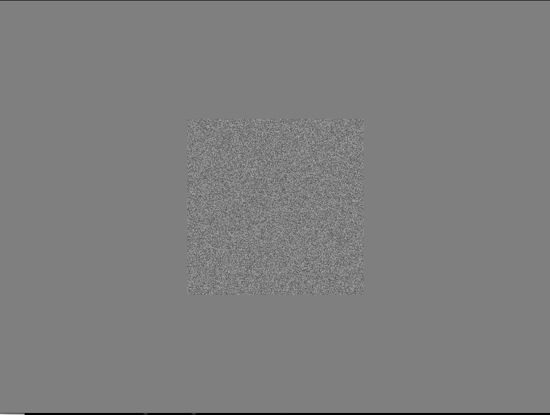
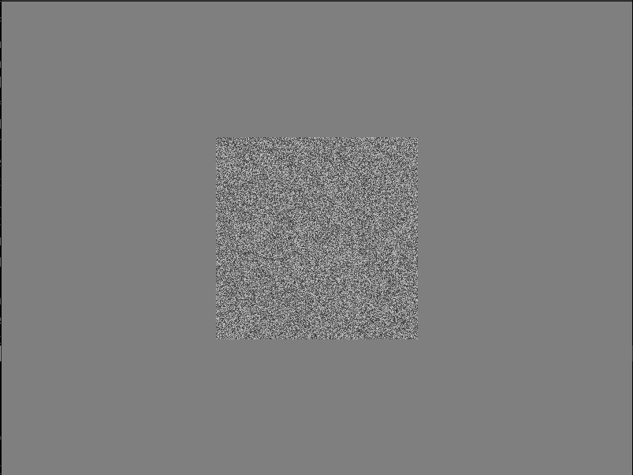
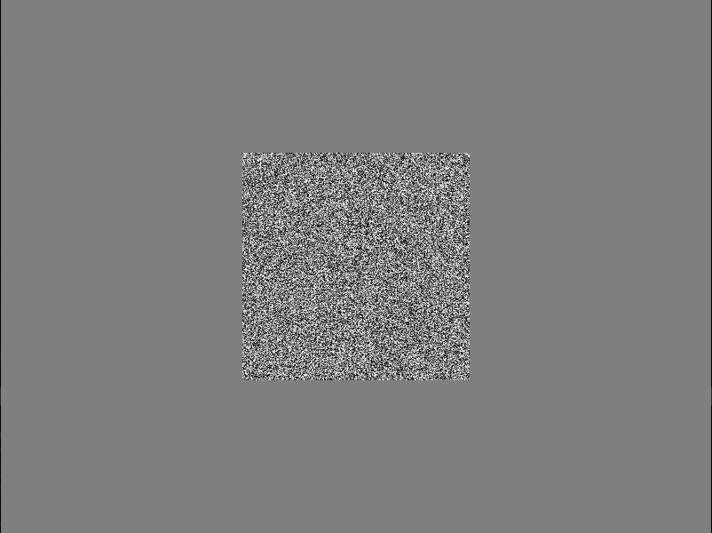

# Show stimuli

This page show how an example of how to display stimuli one by one from a list.
The script initializes HRL, generates three random textures of different contrast, and presents one
at the time in the center of the screen. By pressing the left and right
button you can switch which texture to show.
 
It demonstrates also modularity: stimuli generation, display, and processing of button 
responses are separated in functions. 
This makes our code clearer and easy to read and reuse later.


## Set-up

We start by importing `HRL`, and setting some global variables for 
the window size.

```{code-block} python
from hrl import HRL
import numpy as np
import sys

# Define window parameters
SHAPE = (600, 800)  # Desired shape of the drawing window (height, width)
CENTER = (SHAPE[0] // 2, SHAPE[1] // 2)  # Center of the drawing window
```


## Modularizing the code

In the [minimal example](../getting-started/minimal-usage-example) 
we coded all steps in a linear fashion, in order to explain better `HRL`
usage. 

In practice, it is better to modularize your code. This means, to define
functions that do one and only one job, and are called multiple times during 
the experiment execution. 

Here we write the following functions:

- `stimuli`: a function that defines and computes all stimuli to be shown
- `display_stim`: function that displays the stimulus using `HRL`
- `select`: a function that depending on button presses, it
  selects which stimulus to show, from a given list.
- `main` function, which is the top of the hierarchy and coordinates 
  everything

After modularizing our code, the final structure will be like this:


```{code-block} python
from hrl import HRL
import numpy as np
# (...) other imports


# SET-UP
# (global variables)


# Function definitions
def stimuli():    # (define all stimuli as numpy arrays)
   ...
   
def display_stim(ihrl, ...):
   ...
   
def select(ihrl, ...):
   ...
     
def main(ihrl):
   ...

if __name__ == "__main__":
    # Create HRL interface object
    ihrl = HRL(
        graphics="gpu",  # Use the default GPU as graphics device driver
        # graphics='datapixx',    # In the lab, we use the datapixx device driver
        inputs="keyboard",  # Use the keyboard as input device driver
        # inputs="responsepixx",  # In the lab, we use the responsepixx input device
        hght=SHAPE[0],
        wdth=SHAPE[1],
        scrn=0,  # Which screen (monitor) to use
        fs=False,  # Fullscreen?
        bg=0.5,  # background intensity (black=0.0; white=1.0)
    )
    experiment_main(ihrl)
    ihrl.close()    
```

The last part of the code, which starts with `if __name__ == "__main__"`,
is the python-way to ensure that that enclosed code (our experiment)
is executed only when the code is run as a script, from the command-line.
This is good practice in python, as all python files are also 
importable. This bit ensures that the experiment code is not 
executed if imported.

Inside this section we initialize `HRL` and call the `main` function,
which is the one coordinating the rest. When the `main` function finishes,
it closes `HRL`.


### Function `experiment_main`

The main function first generate all stimuli by calling
the function `stimuli`. 
Then, in an infinite loop, it shows the current stimulus 
(indexed in variable `stim_idx`) by calling 
`display_stim`, and then calls the function `select` which waits for a 
button press. The function `select` returns a new stimulus index which 
will be shown. The loop is broken by pressing `Escape`, which triggers
a system exit call (see `select` definition below).
 

```{code-block} python
def experiment_main(ihrl):
    stims = stimuli()
    stim_names = [*stims.keys()]
    print(f"Stimuli available: {stim_names}")

    stim_idx = 0
    while True:
        # Main loop
        try:
            # Display stimulus
            stim_name = stim_names[stim_idx]
            print(f"Showing {stim_name}")
            
            stim_image = stims[stim_name]
            display_stim(ihrl, stim_image)

            # Select next stim
            stim_idx, _ = select(ihrl, value=stim_idx, rng=len(stim_names) - 1)
            
        except SystemExit as e:
            # Cleanup
            print("Exiting...")
            ihrl.close()
            raise e
            
```

### Function `stimuli`

Defines all stimuli, returning a dictionary with its name as key,
and the stimulus itself as a numpy array as value


```{code-block} python
def stimuli():
    """ Defines three random textures with low, mid and high contrast"""
    
    high = np.random.uniform(low=0.0, high=1.0, size=(256, 256)) 
    mid = np.random.uniform(low=0.2, high=0.8, size=(256, 256))
    low = np.random.uniform(low=0.35, high=0.65, size=(256, 256))
        
    stims = {'low contrast ': low,
             'mid contrast ': mid,
             'high contrast ': high}
             
    return stims 
```


### Function `display_stim`

```{code-block} python
def display_stim(ihrl, stim_image):
    """
    In this "experiment", we just display a collection of stimuli, one at a time.
    Here we define a function to display a single stimulus image centrally on the screen.
    """

    # Convert the stimulus image(matrix) to an OpenGL texture
    stim_texture = ihrl.graphics.newTexture(stim_image)

    # Determine position: we want the stimulus in the center of the frame
    pos = (CENTER[1] - (stim_texture.wdth // 2), CENTER[0] - (stim_texture.hght // 2))

    # Create a display: draw texture on the frame buffer
    stim_texture.draw(pos=pos, sz=(stim_texture.wdth, stim_texture.hght))

    # Display: flip the frame buffer
    ihrl.graphics.flip()

    return
```


### Function `select`

We'll use the Left/Right keys to go through the list of stimuli,
and the Escape/Space keys to terminate.

Here we define a function that captures and processes responses.
On Escape, it raises a *SystemExit* exception to terminate.
On Left/Right, it decreases/increases the index
into the list of stimuli by 1.
To prevent *IndexErrors*, make sure that the index cannot be <0 or >max


```{code-block} python
def select(ihrl, value, rng):
    """Allow participant to select a value from a range of options

    Parameters
    ----------
    ihrl : hrl-object
        HRL-interface object to use for display
    value : int
        currently selected option
    rng : (int, int)
        min and max values to select. If one value is given, assume min=0

    Returns
    -------
    int
        currently selected option
    bool
        whether this option was confirmed

    Raises
    ------
    SystemExit
        if participant/experimenter terminated by pressing Escape
    """
    try:
        len(rng)
    except:
        rng = (0, rng)

    accept = False

    press, _ = ihrl.inputs.readButton(btns=("Left", "Right", "Escape", "Space"))

    if press == "Escape":
        # Raise SystemExit Exception
        sys.exit("Participant terminated experiment.")
    elif press == "Left":
        value -= 1
        value = max(value, rng[0])
    elif press == "Right":
        value += 1
        value = min(value, rng[1])
    elif press == "Space":
        accept = True

    return value, accept
```


## Full example

Putting everything together, we have an script that initializes HRL,
generates three random textures of different contrast, and presents one
at the time in the center of the screen. By pressing the left and right
button you can switch which texture to show.
 

```
from hrl import HRL
import numpy as np
import sys

# Define window parameters
SHAPE = (600, 800)  # Desired shape of the drawing window (height, width)
CENTER = (SHAPE[0] // 2, SHAPE[1] // 2)  # Center of the drawing window

def stimuli():
    """ Defines three random textures with low, mid and high contrast"""
    
    high = np.random.uniform(low=0.0, high=1.0, size=(256, 256)) 
    mid = np.random.uniform(low=0.2, high=0.8, size=(256, 256))
    low = np.random.uniform(low=0.35, high=0.65, size=(256, 256))
        
    stims = {'low contrast ': low,
             'mid contrast ': mid,
             'high contrast ': high}
             
    return stims 

def display_stim(ihrl, stim_image):
    """
    In this "experiment", we just display a collection of stimuli, one at a time.
    Here we define a function to display a single stimulus image centrally on the screen.
    """

    # Convert the stimulus image(matrix) to an OpenGL texture
    stim_texture = ihrl.graphics.newTexture(stim_image)

    # Determine position: we want the stimulus in the center of the frame
    pos = (CENTER[1] - (stim_texture.wdth // 2), CENTER[0] - (stim_texture.hght // 2))

    # Create a display: draw texture on the frame buffer
    stim_texture.draw(pos=pos, sz=(stim_texture.wdth, stim_texture.hght))

    # Display: flip the frame buffer
    ihrl.graphics.flip()

    return

def select(ihrl, value, rng):
    """Allow participant to select a value from a range of options

    Parameters
    ----------
    ihrl : hrl-object
        HRL-interface object to use for display
    value : int
        currently selected option
    rng : (int, int)
        min and max values to select. If one value is given, assume min=0

    Returns
    -------
    int
        currently selected option
    bool
        whether this option was confirmed

    Raises
    ------
    SystemExit
        if participant/experimenter terminated by pressing Escape
    """
    try:
        len(rng)
    except:
        rng = (0, rng)

    accept = False

    press, _ = ihrl.inputs.readButton(btns=("Left", "Right", "Escape", "Space"))

    if press == "Escape":
        # Raise SystemExit Exception
        sys.exit("Participant terminated experiment.")
    elif press == "Left":
        value -= 1
        value = max(value, rng[0])
    elif press == "Right":
        value += 1
        value = min(value, rng[1])
    elif press == "Space":
        accept = True

    return value, accept
    
 
def experiment_main(ihrl):
    stims = stimuli()
    stim_names = [*stims.keys()]
    print(f"Stimuli available: {stim_names}")

    stim_idx = 0
    while True:
        # Main loop
        try:
            # Display stimulus
            stim_name = stim_names[stim_idx]
            print(f"Showing {stim_name}")
            
            stim_image = stims[stim_name]
            display_stim(ihrl, stim_image)

            # Select next stim
            stim_idx, _ = select(ihrl, value=stim_idx, rng=len(stim_names) - 1)
            
        except SystemExit as e:
            # Cleanup
            print("Exiting...")
            ihrl.close()
            raise e    
    

if __name__ == "__main__":
    # Create HRL interface object
    ihrl = HRL(
        graphics="gpu",  # Use the default GPU as graphics device driver
        # graphics='datapixx',    # In the lab, we use the datapixx device driver
        inputs="keyboard",  # Use the keyboard as input device driver
        # inputs="responsepixx",  # In the lab, we use the responsepixx input device
        hght=SHAPE[0],
        wdth=SHAPE[1],
        scrn=0,  # Which screen (monitor) to use
        fs=False,  # Fullscreen?
        bg=0.5,  # background intensity (black=0.0; white=1.0)
    )
    experiment_main(ihrl)
    ihrl.close()   
    
```

### Screenshots

## Screenshots

First screen shows


After pressing 'Right' we see the texture at mid contrast...


After pressing 'Right' again we see the texture with high contrast.



Pressing 'Left' goes in the opposite direction.


