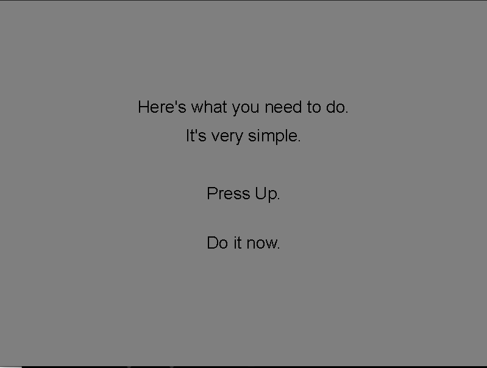
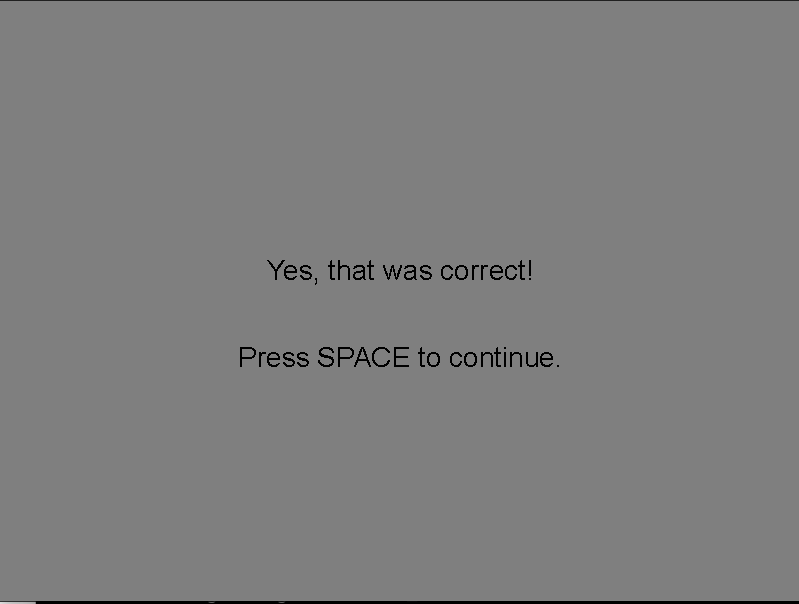

# Text displays

In this example we show text to the observer, asking him to 
press a button. 
When pressed, the observer gets feedback.
Which button to press is determined randomly (like the game 'Simon says')

In the code we have separated the functions related to displaying 
text into a module called `text_displays.py`. 
The function `display_text` is imported from this module.
In later examples this module will be included as well.
The


## Install requirements

Apart from `HRL`, you need the Pillow (PIL) library to draw text. 
You need to install this library in your python environment, for example with `pip`

```
pip install Pillow
```

## Main script

The main script has the function `experiment_main` which is the entry
point of execution. First, this function picks one direction at random 
(up, down, left or right), then displays a text asking the
observer to press that button by calling function `show_instructions`,
and then waits for a keyboard response by calling function `process_response`.
If the button was correctly pressed, it show again some text saying so
by calling function `show_correct`. 
All these steps occur in a infinite loop until "Escape" is pressed.

Notice that we have further modularized the code into several functions.


```{code-block} python
import sys
import numpy as np
from hrl import HRL
from text_displays import display_text

# Define window parameters
SHAPE = (600, 800)  # Desired shape of the drawing window (height, width)
CENTER = (SHAPE[0] // 2, SHAPE[1] // 2)  # Center of the drawing window
BACKGROUND = 0.5

DIRECTIONS = ["Left", "Right", "Up", "Down"]

# random generator
rng = np.random.default_rng()

def show_instructions(ihrl, direction):
    """Display instructions to the participant

    Parameters
    ----------
    ihrl : hrl-object
        hrl-interface object to use for display
    direction : str
        which key the participant should press
    """
    lines = [
        "Here's what you need to do.",
        "It's very simple.",
        "",
        f"Press {direction}.",
        "",
        "Do it now.",
    ]

    display_text(ihrl=ihrl, text=lines)

    return


def show_correct(ihrl):
    """Display message that participant pressed the correct button

    Parameters
    ----------
    ihrl : hrl-object
        hrl-interface object to use for display
    """
    lines = [
        "Yes, that was correct!",
        "",
        "Press SPACE to continue.",
    ]
    display_text(ihrl=ihrl, text=lines)


def process_response(ihrl, direction):
    """Process participant's keypress

    Parameters
    ----------
    ihrl : hrl-object
        hrl-interface object to use for display
    direction : str
        which key the participant should press

    Returns
    -------
    bool
       whether keypress was correct

    Raises
    ------
    SystemExit
        if participant/experimenter terminates experiment by pressing "Escape"
    """
    press, _ = ihrl.inputs.readButton()

    if press in ("Escape"):
        # Raise SystemExit Exception
        sys.exit("Participant terminated experiment.")
    elif press == direction:
        return True
    else:
        return False


def experiment_main(ihrl):
    """Run adjustment experiment on specified display

    Parameters
    ----------
    ihrl : hrl-object
        hrl-interface object to use for display

    Raises
    ------
    SystemExit
        if participant/experimenter terminates experiment
    """
    while True:
        # Main loop
        try:
            # Pick a direction, randomly
            idx = rng.integers(low=len(DIRECTIONS))
            direction = DIRECTIONS[idx]

            # Display text
            show_instructions(ihrl, direction)

            # Wait for key
            response_correct = False
            while not response_correct:
                response_correct = process_response(ihrl, direction)

            # Show correct response screen
            show_correct(ihrl)
            ihrl.inputs.readButton(btns="Space")

        except SystemExit as e:
            # Cleanup
            print("Exiting...")
            ihrl.close()
            raise e


if __name__ == "__main__":
    # Create HRL interface object
    ihrl = HRL(
        graphics="gpu",  # Use the default GPU as graphics device driver
        # graphics='datapixx',    # In the lab, we use the datapixx device driver
        inputs="keyboard",  # Use the keyboard as input device driver
        # inputs="responsepixx",  # In the lab, we use the responsepixx input device
        hght=SHAPE[0],
        wdth=SHAPE[1],
        scrn=1,  # Which screen (monitor) to use
        fs=False,  # Fullscreen?
        bg=BACKGROUND,  # background intensity (black=0.0; white=1.0)
    )
    experiment_main(ihrl)
    ihrl.close()
```


## Module `text-displays.py`

```{code-block} python
import numpy as np
from PIL import Image, ImageDraw, ImageFont

def create_text_texture(text, 
                        intensity_text=0.0,
                        intensity_background=0.5,
                        fontsize=28,
                        align="center",
                        ):
    """ Draw given text into a (numpy) image-array 
    
    It uses Pillow in mode "F", that is, a mode using floating point
    values and only one channel (grayscale).
    

    Parameters
    ----------
    text : str
        Text to draw
    intensity_text : float, optional
        intensity of text in range (0.0; 1.0), by default 0.0
    intensity_background : float, optional
        intensity value of background in range (0.0; 1.0), by default 0.5
    fontsize : int, optional
        font size, by default 36
    align : "left", "center" (default), "right"
        alignment of text, by default "center"

    Returns
    -------
    numpy array 
       containing the text as an image
        
    """
    # Get font
    font = ImageDraw.ImageDraw.font
    if not font:
        try:
            # Not all machines will have Arial installed...
            font = ImageFont.truetype(
                "arial.ttf",
                fontsize,
                encoding="unic",
            )
        except OSError:
            font = ImageFont.load_default()
    
    # Determine dimensions of total text
    n_lines = len(text.split("\n"))
    max_length = 0
    for line in text.split("\n"):
        max_length = max(int(font.getlength(line)), max_length)
    _, top, _, bottom = font.getbbox(text)
    text_width = max_length
    text_height = int(top + bottom) * n_lines
    text_shape = (text_height, text_width)

    # Instantiate grayscale image of correct shape (in pixels)
    img = Image.new("F", (text_width, text_height), intensity_background)
    draw = ImageDraw.Draw(img)

    # Draw text into this image
    draw.text(
        (0, 0),
        text,
        fill=intensity_text,
        font=font,
        align=align,
    )
    
    return img
    
    
def display_text(
    ihrl,
    text,
    fontsize=28,
    intensity_text=0.0,
    intensity_background=None,
):
    """Display a screen with given text, waiting for participant to press button

    Text will be center horizontally.

    Parameters
    ----------
    ihrl : hrl
        HRL-interface object to use for display and input
    text : str, list[str]
        text to display, can be multiple lines
    fontsize : int, optional
        font size, by default 36
    intensity_text : float, optional
        intensity of the text in range (0.0; 1.0), by default 0.0
    intensity_background : float, optional
        intensity of the background in range (0.0; 1.0), if None (default): ihrl.background
    """

    bg = ihrl.background if (intensity_background is None) else intensity_background
       
    # Clear current screen
    ihrl.graphics.flip()

    # Draw each line of text, one at a time
    textures = []
    for line_nr, line in enumerate(text):
        
        # Generate image-array, OpenGL texture
        if line == "":
            line = " "

        text_arr = create_text_texture(
            text=line,
            intensity_text=intensity_text,
            intensity_background=bg,
            fontsize=fontsize,
        )
        
        textline = ihrl.graphics.newTexture(text_arr)

        # Determine position where to draw
        window_shape = (ihrl.height, ihrl.width)
        text_pos = (
            (window_shape[1] - textline.wdth) // 2,
            ((window_shape[0] // 2) - ((len(text) // 2) - line_nr) * (textline.hght + 10)),
        )

        # Draw the line
        textline.draw(pos=text_pos)

    # Display
    ihrl.graphics.flip()

    return

```


## Screenshots

First screen shows


After pressing Up...


